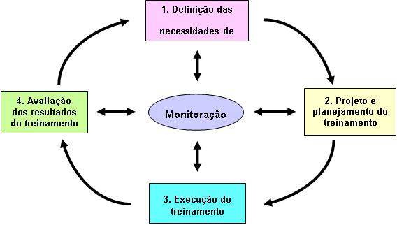

#Treinamento

[TOC]

##Termos e definições

* **Competência** - Aplicação do conhecimento, habilidade e comportamento no desempenho.
* **Treinamento** - Processo para desenvolver e prover conhecimento, habilidades e comportamentos para atender necessidades levantadas.
* **Instrutor** - Pessoal que aplica um método de treinamento.
* **Aluno** - Pessoal ao qual será aplicado o método de treinamento.

## Geral
Visão geral do processo de treinamento, como um processo de quatro estágios.

*(NBR 10015, pag 3)*

##Diretrizes

###Levantamento das necessidades

O levantamento tem por objetivo identificar as carências de indivíduos e/ou grupos para a execução das tarefas dentro da organização.
Deve-se realizar uma análise da demanda, de forma a conhecer o público-alvo e identificar as necessidades.

**Exemplos de necessidades:**
* Aprender uma nova linguagem que é utilizada somente em alguns projetos da organização.
* Aperfeiçoar o conhecimento em refatoração, para melhor lidar com déficit técnico.
* Utilização de um novo framework.

Este levantamento pode ser realizado por diversos meios, como entrevistas, questionários, etc.
É adequado que, antes de iniciar o plano de treinamento, se realize uma análise das necessidades, as relacionando as competências que se desejam obter.

* Opcional: Criar um pequeno formulário (ex. Google Form), com os tópicos que irá apresentar. Aplicar esse formulário no grupo que será treinado, de forma a ter uma referência inicial neste momento.

Realize uma revisão, levando em conta o conhecimento anterior do grupo de participantes.

#### Definição do objetivo
O objetivo do treinamento deve se basear nas competências a serem desenvolvidas, sendo este o resultado de sucesso efetivo esperado. Deve-se definir as lacunas entre o conhecimento/competência existente e a requerida/desejada.

Após essa definição, é necessário determinar se tais lacunas podem ser supridas por um treinamento , ou outra ação pode ser necessária, como reformulação de processo, melhoria e/ou substituição de recursos.

Como ponto final nesta etapa, é importante se ter em mente:
* **Treinamentos Básico** - imprescindíveis para a formação das competências mínimas requeridas.
* **Treinamentos Intermediário/Avançado** - aperfeiçoamento de habilidades e competências, de forma a possibilitar melhoria individual/profissional.

###Projeto e Planejamento

Após o diagnóstico de necessidades, passa-se à enumeração das ações com vista a saná-las.

####Limitações

Há itens que podem restringir o processo de treinamento, tais como:

* **Considerações financeiras** - Custos de material e do tempo hora/pessoa necessário para adquirir proficiente no conhecimento abordado.
* **Requisitos de prazo e programação** - Tempo limite para determinado grupo atingir proficiência em determinado assunto. Comum a equipes que estejam iniciando um projeto em novo domínio.
* **Disponibilidade, motivação e capacidade da pessoa a ser treinada** - Para certas modalidades de treinamento é necessário obter um número mínimo de pessoas a serem treinadas. Outro ponto que pode restringir o treinamento, é a necessidade de conhecimento/proficiência anterior em determinado assunto.

####Definição dos métodos

Dentre a definição dos métodos o autotreinamento e treinamento no local de trabalho são os que mais se adequa a nossa realidade.

* **Autotreinamento** - Fazendo uso de um conjunto de materiais e autoavaliações, práticas e teóricas, o aluno obtém o conhecimento sem a necessidade de acompanhamento externo. É necessário, para fim de melhoria e auditoria do processo de treinamento, a preparação de um relatório do treinamento.
	* **Projetos protótipos** - Uso de pequenos projetos, de forma a fixar o conhecimento e domínio de ferramental, devendo possuir um sistema de auto-verificação.
* **Treinamento em local de trabalho** - O conhecimento é passado para os treinados com um auxílio de um instrutor/facilitador. Possuindo variações:
	* **Expositivo** - Apresenta-se o tópico de estudo, detalhando suas caracteristicas.
	* **Oficinas** - Atividades práticas em pequenos grupos, de forma a promover a cooperação, análise e prática do conhecimento.
	* **Laboratório** - Estudos experimentais, de conteúdos ou ferramentais. Uma boa forma de realização uma polinização cruzada entre equipes que trabalham em contextos diversos.

####Critérios de seleção

Para uma correta escolha de método, é importante observar as seguintes questões:

* **Objetivos do treinamento** - Qual a lacuna de conhecimento que se deseja preencher.
* **Público-alvo** - Cargos, ou atividades profissionais, número de participantes.
* **Duração do treinamento** - Quanto tempo é necessário para realizar todo o processo de treinamento. Deve-se levar em conta o tempo necessário para avaliações e apoio, sendo importante manter uma pequena margem para o fomentar o diálogo e reflexão no processo.
* **Data e local** - Para certas modalidades de treinamento, faz-se necessário prosseguir de forma contínua por maior período de tempo, subdividindo o treinamento em menores partes. Logo,deve se observar a agenda de projetos para o momento mais propício, de forma a não perder a cadência de ensino nem afetar os processos internos.
* **Infraestrutura e instalações** - Treinamentos em local de trabalho pressupõe que todos terão em mãos os recursos necessários para realização dos estudos. Portanto, é importante dimensionar corretamente a estrutura disponível.
* **Custo** - Aquisição de recursos. Um tópico posterior trata da questão custo/hora.
* **Formas de avaliação e certificação** - Quais formas de avaliação serão adotadas de forma a determinar o nível de absorção do conhecimento. Como elas se ajustam às necessidades do público -alvo para determinar sua capacidade de certificar.

---

###Plano de treinamento/Curso

Deve-se ter como objetivo do treinamento as competências a serem desenvolvidas, com a finalidade ter o correto foco é propiciar uma comunicação clara e aberta.

#### Início - Defina o objetivo
Qual é o objetivo do treinamento. Quais os objetivos básico que se deseja obter? Quais lacunas de conhecimento se espera preencher neste processo.

>* *Objetivo Geral: Capacitar os desenvolvedores na ferramenta de gestão de versões Git de forma a dominarem o mundo.*
* objetivos específicos: Uso da interface de linha de comando para operação da ferramenta. 

#### Limite de tempo
Determine o tempo necessário para aplicar o treinamento, antes de preparar e começar a organizar os assuntos. Com essa informação determine a necessidade ou não de dividir o treinamento em menores partes.

>*Carga Horário 5 horas - Aplicação: Duas apresentações de 1 hora cada e 3 horas de workshop com hand-on.*

>**!** - Antes de detalhar é apenas uma pré-estimativa. Na prática, ainda no estágio do plano, se apresenta como um processo interativo (muito extenso: enxugar, muito curto: detalhar mais), sendo esta validade na primeira execução.

#### O Plano
Detalhar o  plano na forma de temas, tópicos e seus objetivos específicos. Cada tópico deve possuir um objetivo específico. Este também deve possuir o método utilizado para passar esse conhecimento. O tópico ainda deve apresentar o tempo estimado a sua realização.

É recomendado definir quais recursos irá utilizar para abordar cada tópico.

|Tópico|Objetivo|Método|Recurso|Tempo|
|--------|--------|------|-------|------|
|Apresentação da ferramenta|Garantir que todos conheçam a ferramenta e a que se destina|Exposição|Slides|20 min|
|Instalação da ferramenta|Todos os participantes tenham o ferramental necessário|Exposição, Hand-on|Slides|15 min|
|...|...|...|...|...|
|Demo Dominação Mundial|Validação do conhecimento apresentado|Realização de um pequeno desafio|Hand-on, Github code|3 horas|

##### Revisão
Realize todo o processo até ter detalhado a conceitos básicos, que possam ser facilmente aprendidos.

Ao ter concluído esse passo, procure observar se os tópicos adicionados se atém ao objetivo geral. Ou foram somente adicionando por parecerem *“divertidos”* e/ou *“legais”*.

Talvez seja interessante partir para tópicos mais avançados de forma a manter o interesse. Ou o inverso, diminuir e tornar mais dinâmico o material e recursos para auxiliar o entendimento de temas mais complexos.

* Opcional: Peça para o plano ser revisado por outro colaborador, antes da entrega para avaliação.

#### Aprovação
Passe para aprovação, caso seja necessária. Se foram necessários ajustes, devido a questões de tempo, conteúdo, ou mesmo tecnologia empregada, crie uma segunda versão do plano de curso, realizando os ajustes necessários.

#### Produção
Com o plano de curso revisado e aprovado, pode iniciar a produção do material que utilizará para o ensino.

#### Revisão
Realizar uma revisão do conteúdo detalhado.

#### Execução

Seguindo a estrutura definida anteriormente, parte-se para execução do treinamento com a sua aplicação prática, possuindo três fatores fundamentais:

* A qualidade da aplicação do conteúdo
* A eficiência dos resultados
* Monitoração da qualidade do treinamento oferecido.

---

###Aplicação do treinamento

#### Pré-treinamento
O objetivo desta etapa é garantir o fornecimento dos recursos, e o nivelamento básico do alunos, de forma a obter o melhor aproveitamento do treinamento.

* Fornecer ao instrutor* as informações necessárias e acesso ao recursos que serão utilizados.
* Informar o aluno sobre a natureza do treinamento, quais lacunas de competência se pretende eliminar. Se necessário, quais recursos este deve ter anteriormente a iniciar o treinamento.

>*O instrutor pode ou não ser o elaborador do conteúdo.

#### Treinamento
Etapa operacional, abrange o treinamento em si.

* Fornecer a infraestrutura necessária.
* Fornecer oportunidades/atividades pertinentes para o treinado de forma a aplicar as competências em desenvolvimento.

#### Pós-treinamento
Esta etapa se destina principalmente à avaliação, melhoramento, métrica e auditoria.

* **Recebimento de informações do treinado** - através de um relatório de treinamento, para avaliação da satisfação e qualidade do material apresentado nessa perspectiva.
* **Recebimento de informações do instrutor** - um pequeno relatório que deve priorizar os pontos fortes e fracos do processo, dificuldades encontradas para a passagem do conhecimento.
* **Fornecimento de informações para formação de métricas** - para gestores e pessoal envolvido no treinamento. Métricas, índices com base nas informações dos relatórios de instrutor/alunos.
* **Avaliação** - Mensuração do conhecimento absorvido por parte do Aluno. 

>**!** - **Avaliação como validação de conhecimento prévio** - Se houver casos que alunos, desejam somente validar seu conhecimento prévio, no assunto do treinamento.  Deve-se dar como opção, realizar a avaliação de forma isolada.

##### Relatório de avaliação
É conveniente que ao concluir o treinamento, este seja devidamente documentado nos registros de treinamento.
Este relatório pode incluir:

* Necessidades de treinamento - Em forma resumida, com seus principais tópicos.
* Critério de avaliação e descrição das fontes, métodos e períodos para avaliação.
* Análise de dados coletados e interpretação dos resultados.
* Análise crítica dos custos do treinamento.
* Conclusões e recomendações para melhoria.
* Observações.
	* Ações de não conformidades
	* Impedimentos
	* Sugestões

---

###Avaliação dos resultados
Corresponde ao último estágio do processo de treinamento. Para permitir comparar o resultado ao esperado na execução.
A permanência dos problemas/lacunas diagnosticados após treinamento, deve levar a uma avaliação dos seguintes pontos para um replanejamento do treinamento.

Os resultados do treinamento em geral não podem ser plenamente abalizados até que o aluno possa ser observado e avaliado no desempenho do seu trabalho.

* **O diagnóstico foi mal feito** - a avaliação não está adequada ao tipo de atividade que se deseja avaliar.
* **A programação não foi correta** - o sequenciamento do conteúdo não foi adequado para sua assimilação.
* **A execução do treinamento foi precária** - falta de didática, uso de metodologias inadequadas ao tipo de conhecimento que se deseja passar.
* **A condição de trabalho não foi adequada** - falta de infraestrutura, ou recursos/materiais inadequados
* **O aluno não se encontrava motivado** - falta de interesse pelo assunto apresentado
* **O aluno não era capaz para aquele tipo de treinamento** - não possuía o conhecimento básico necessário para aquisição de temas mais avançados.
* **O conteúdo apresentado não está atualizado** - o material apresenta informações defasadas quanto a tecnologia ou ferramental.
* **Infra Estrutura não adequada** - Os recursos utilizados no treinamento, os quais podem possibilitar uma melhoria na aprendizagem quando corretamente dimensionados ao número de alunos, e com didática condizente. Para garantir a padronização do treinamento, e a correta validação posterior é de suma importância que sejam discriminados nas observações do instrutor, quais materiais foram planeados, quais foram realmente utilizados.

É conveniente que as avaliações sejam feitas, em mais de um período. 
* **A curto prazo** -Opinião sobre métodos/recursos adotados, e sobre os conhecimento e habilidades adquiridas como resultado. *Um exemplo: Ao se fazer uso da metodologia de projetos protótipos, pode-se obter uma métrica da proficiência do treinado naquele cenário.*
* **A longo prazo** - Melhoria de produtividade/qualidade e do desempenho no trabalho.

---

##Monitoramento e Auditoria

###Validação do processo de treinamento
Conduzida por um profissional externo, que verifique se os o processo de treinamento foi conduzido da maneira estabelecida.
Para a melhoria contínua do processo de treinamento, deve ser coletado, identificado e registrado, todos os itens não conformes aos procedimentos e requisitos. Propondo ações corretivas para melhoria.

* **Procedimento foram seguidos e requisitos alcançados** - O registros devem ser atualizados para refletir a competência adicional.
* **Procedimentos não foram seguidos mas requisitos foram alcançados** - O procedimentos deverão ser revistos. O registros devem ser atualizados para refletir a competência adicional.
* **Procedimentos foram seguidos mas os requisitos não foram alcançados** - Propor ações corretivas, ou desenvolver uma solução alternativa de treinamento.

---

##Referências
ASSOCIAÇÃO BRASILEIRA DE NORMAS TÉCNICAS. NBR 10015: Gestão de qualidade- Diretrizes para treinamento. Rio de Janeiro: ABNT, 2001

BLOOM, B. S. et al. Taxonomia de objetivos educacionais: domínio cognitivo. Porto Alegre: Globo, 1979.

GIL, Antonio Carlos. Gestão de pessoas: enfoque nos papéis profissionais. – São Paulo: Atlas, 2001.

GAGNÉ, R. M.; BRIGS, L. J.; WAGNER, W. W. Principles of instructional design. Orlando, Florida: Holt, Rinehart and Winston, 1988.

SILVA, Deborah Ribeiro. Educação Corporativa. Disponível em:  http://www.fecap.br/Portal/Arquivos/Graduacao_Rev_Estudante_On_Line/Educacao_Corporativa_Deborah_Ribeiro_Silva.pdf. Pesquisado em 25/11/2016.

